* Table of Contents
{:toc}

--------------------------------------------------------------------------------------------------------------------

## **Setting up, getting started**

Refer to the guide [_Setting up and getting started_](SettingUp.md).

--------------------------------------------------------------------------------------------------------------------

## **Design**

### Architecture

The ***Architecture Diagram*** given above explains the high-level design of the App. Given below is a quick overview of each component.

:bulb: **Tip:** The `.puml` files used to create diagrams in this document can be found in the [diagrams](https://github.com/AY2021S1-CS2103-W14-4/tp/tree/master/docs/diagrams/) folder. Refer to the [_PlantUML Tutorial_ at se-edu/guides](https://se-education.org/guides/tutorials/plantUml.html) to learn how to create and edit diagrams.

**`Main`** has two classes called [`Main`](https://github.com/AY2021S1-CS2103-W14-4/tp/tree/master/src/main/java/seedu/clinic/Main.java) and [`MainApp`](https://github.com/AY2021S1-CS2103-W14-4/tp/tree/master/src/main/java/seedu/clinic/MainApp.java). It is responsible for,
* At app launch: Initializes the components in the correct sequence, and connects them up with each other.
* At shut down: Shuts down the components and invokes cleanup methods where necessary.

[**`Commons`**](#common-classes) represents a collection of classes used by multiple other components.

The rest of the App consists of four components.

* [**`UI`**](#ui-component): The UI of the App.
* [**`Logic`**](#logic-component): The command executor.
* [**`Model`**](#model-component): Holds the data of the App in memory.
* [**`Storage`**](#storage-component): Reads data from, and writes data to, the hard disk.

Each of the four components,

* defines its *API* in an `interface` with the same name as the Component.
* exposes its functionality using a concrete `{Component Name}Manager` class (which implements the corresponding API `interface` mentioned in the previous point.

For example, the `Logic` component (see the class diagram given below) defines its API in the `Logic.java` interface and exposes its functionality using the `LogicManager.java` class which implements the `Logic` interface.

**How the architecture components interact with each other**

The *Sequence Diagram* below shows how the components interact with each other for the scenario where the
 user issues the command `delete ct/s i/12`.

The sections below give more details of each component.

### UI component

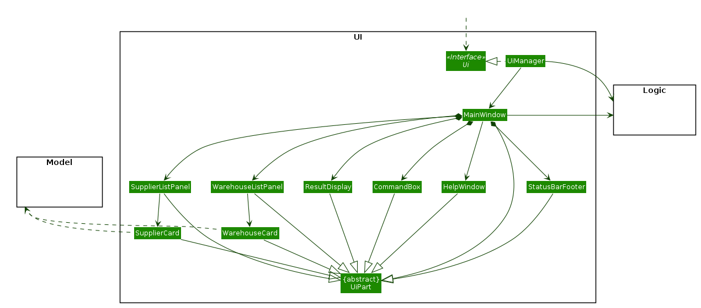

**API** :
[`Ui.java`](https://github.com/AY2021S1-CS2103-W14-4/tp/tree/master/src/main/java/seedu/clinic/ui/Ui.java)

The UI consists of a `MainWindow` that is made up of parts e.g.`CommandBox`, `ResultDisplay`, `SupplierListPanel`, `WarehouseListPanel`, `StatusBarFooter` etc. All these, including the `MainWindow`, inherit from the abstract `UiPart` class.

The `UI` component uses JavaFx UI framework. The layout of these UI parts is defined in matching `.fxml
` files that are in the `src/main/resources/view` folder. For example, the layout of the [`MainWindow
`](https://github.com/AY2021S1-CS2103-W14-4/tp/tree/master/src/main/java/seedu/clinic/ui/MainWindow.java) is
 specified in [`MainWindow.fxml`](https://github.com/AY2021S1-CS2103-W14-4/tp/tree/master/src/main/resources/view/MainWindow.fxml)

The `UI` component,

* Executes user commands using the `Logic` component.
* Listens for changes to `Model` data so that the UI can be updated with the modified data.

### Logic component

**API** :
[`Logic.java`](https://github.com/AY2021S1-CS2103-W14-4/tp/tree/master/src/main/java/seedu/clinic/logic/Logic.java)

1. `Logic` uses the `ClinicParser` class to parse the user command.
1. This results in a `Command` object which is executed by the `LogicManager`.
1. The command execution can affect the `Model` (e.g. adding a supplier).
1. The result of the command execution is encapsulated as a `CommandResult` object which is passed back to the `Ui`.
1. In addition, the `CommandResult` object can also instruct the `Ui` to perform certain actions, such as displaying help to the user.

Given below is the Sequence Diagram for interactions within the `Logic` component for the `execute("delete ct/s i/12")` API call.

:information_source: **Note:** The lifeline for `DeleteCommandParser` should end at the destroy marker (X) but due to a limitation of PlantUML, the lifeline reaches the end of diagram.

### Model component

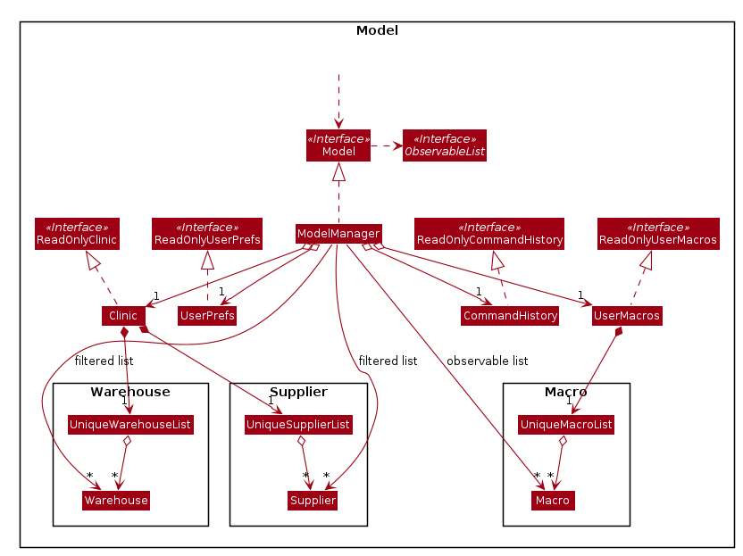

**API** : [`Model.java`](https://github.com/AY2021S1-CS2103-W14-4/tp/blob/master/src/main/java/seedu/clinic/model/Model.java)

The `Model`,

* stores a `UserPref` object that represents the user’s preferences.
* stores the clinic data.
* exposes an unmodifiable `ObservableList<Supplier>` that can be 'observed' e.g. the UI can be bound to this list so that the UI automatically updates when the data in the list change.
* does not depend on any of the other three components.

:information_source: **Note:** An alternative (arguably, a
 more OOP) model is given below. 

### Storage component

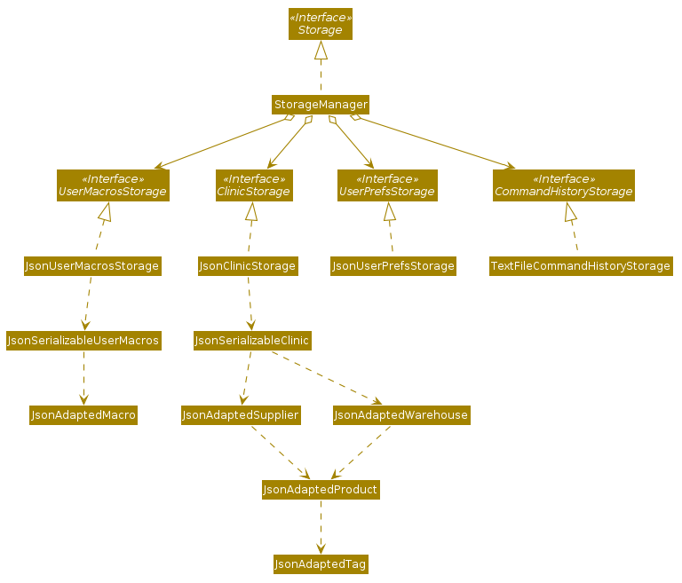

**API** : [`Storage.java`](https://github.com/AY2021S1-CS2103-W14-4/tp/blob/master/src/main/java/seedu/clinic/storage/Storage.java)

The `Storage` component,
* can save `UserPref` objects in json format and read it back.
* can save the clinic data in json format and read it back.

### Common classes

Classes used by multiple components are in the `seedu.clinic.commons` package.

--------------------------------------------------------------------------------------------------------------------

## **Implementation**

This section describes some noteworthy details on how certain features are implemented.

### Delete feature

The `delete` feature will be elaborated in this section by its' functionality, the path execution with the aid of a sequence and an activity diagram.
The details of __DeleteCommand__'s class implementation and its interactions with associated objects will also be discussed.

#### What Delete Feature does

The `delete` feature allows user to remove a warehouse or supplier __(case 1)__.
 
The `delete` feature also allows user to remove a product from a certain warehouse or supplier __(case 2)__.
 
 
In case 1, `TYPE` needs to be set to `w` or `s`.
 
In case 2, `TYPE` needs to be set to `pw` or `ps`, and a `PRODUCT_NAME` needs to be specified.
 
 
The deletion is limited to the items shown in the list displayed in GUI, and is done one item at a time.

#### Path Execution of Delete Command

The workflow of a `Delete` Command when executed by a user is shown in the activity diagram below:

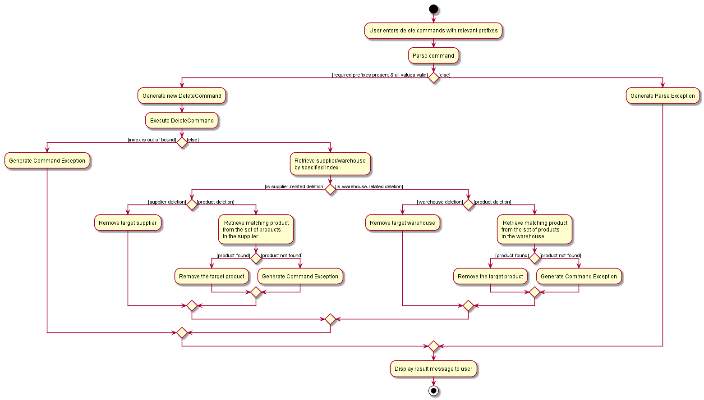

<i>Figure n. Delete Command Activity Diagram</i>

 

With reference to the activity diagram above, the user input will be sent to **`DeleteCommandParser`** for parsing.
The **`DeleteCommandParser`** will check if the compulsory prefixes are present (i.e. `ct/TYPE` and `i/INDEX`) and the corresponding
argument values are all valid.
A **`ParseException`** will be thrown if the check fails.

If the `TYPE` parsed indicates a product deletion (via `ct/ps` or `ct/pw`), an additional field `PRODUCT_NAME` is parsed with its prefix and value checked.

Next, a new **`DeleteCommand`** will be generated and executed. There are four possible paths for the `delete` command:

1. The target to delete is a `supplier`/`warehouse`  
CLI-nic finds the target `supplier`/`warehouse` at the specified `INDEX` of the displayed list, and remove it completely.

1. The `INDEX` specified is invalid (e.g. exceeds the length of the list)  
A **`CommandException`** error message wil be thrown.

1. The target to delete is a `product` in a particular 'supplier'  
CLI-nic finds the target `supplier` at the specified `INDEX` of the displayed supplier list, and retrieve its product list. 
It finds the `product` with specified `PRODUCT_NAME` and remove it from the product list.

1. No `product` has the `PRODUCT_NAME` in the target warehouse/supplier  
A **`CommandException`** error message wil be thrown.

#### Structure of Delete command

We demonstrate the structure of the `delete` feature implementation below.

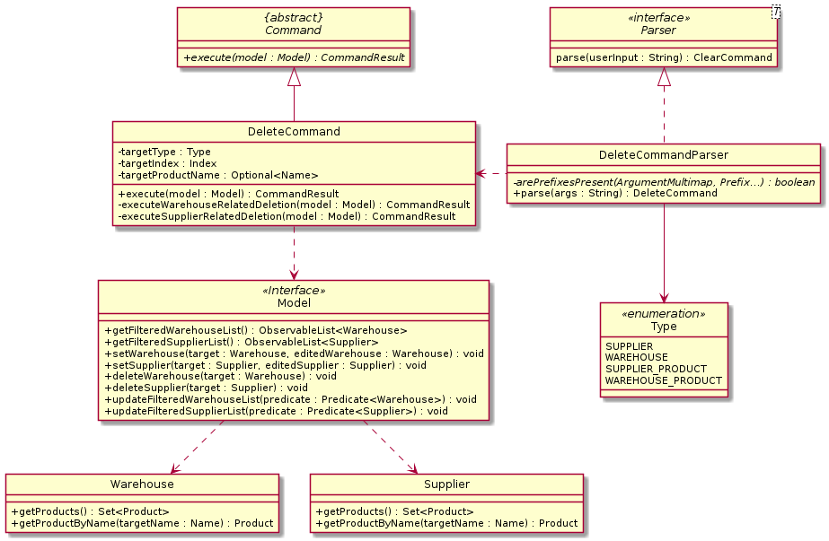

<i>Figure n. Delete Command Class Diagram</i>

 

Note that some commonly applied methods (such as getter/setter methods for each attribute) are not included to reduce verbosity.

#### Delete Command's interaction with related objects

In the following section, the interaction between Delete Command and its associated objects in the delete feature will be discussed.
The sequence diagrams below demonstrate the workflow in the deletion feature.

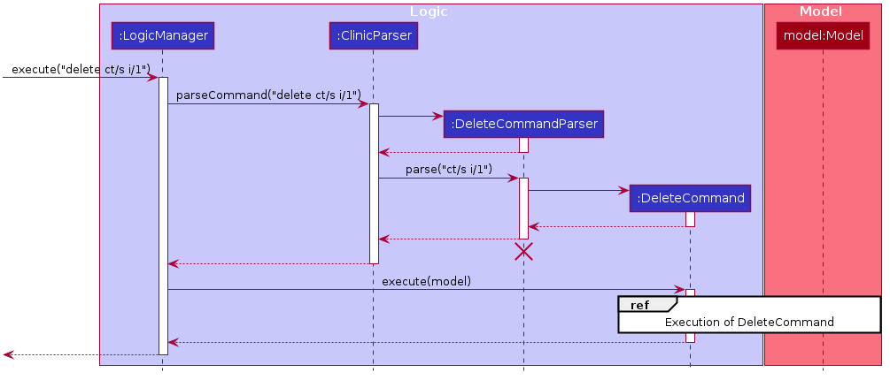

<i>Figure n. Delete Command Sequence Diagram for supplier deletion </i>

 

1. Parsing  

    CLI-nic's `ClinicParser` will parse the user input and if the `delete` command word is present, the parser will try to parse the
    input to generate a valid `DeleteCommand` via `DeleteCommandParser`.  

    Checks for compulsory prefixes and valid arguments (`ct/TYPE` and `i/INDEX` in this case) are done. The code will throw a `ParseException` if the check fails. 

    If multiple entries of `ct/TYPE` or `i/INDEX` are found, the last entry will be used as the argument.  

    Afterwards, all the valid arguments (`INDEX` and `TYPE`) will create a new `DeleteCommand`, which will be executed.

2. Execution  

    The `DeleteCommand` is executed via a `execute` call from `LogicManager`.  

    Using the `targetType` attribute, the execution is first classified as either Supplier deletion (`s`) or Warehouse deletion (`w`).  

    Base on the classification, the model will retrieve the relevant displayed list of warehouse/supplier via `model#getFilteredWarehouseList()`/`model#getFilteredSupplierList()`.  

    It then locates the warehouse/supplier entry that user wants to delete via the `INDEX` passed in.

    Afterwards, `model#deleteWarehouse`/`model#deleteSupplier` will remove the target entry from the list in the `model`. The `model` will then update the displayed list.

3. Result display  
    With the deletion completed, a `CommandResult` will be returned to the `LogicManager` with a success message, which will
    be shown to the user in the UI.

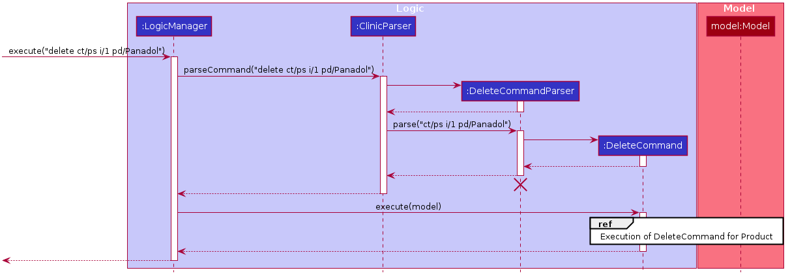

<i>Figure n. Delete Command Sequence Diagram for product deletion</i>

 

1. Parsing

    The parsing workflow is the same except that now an additional field `pd/PRODUCT_NAME` will be checked (with both prefix and argument) and parsed.  

    Afterwards, all the valid arguments (`INDEX`, `TYPE` and `PRODUCT_NAME`) will create a new `DeleteCommand`, which will be executed.

2. Execution

    The `DeleteCommand` is executed via an `execute` call from `LogicManager`.  

    Using the `targetType` attribute, the execution is now classified as either Supplier-related product deletion (`ps`) or Warehouse-related product deletion (`pw`).  

    Based on the classification, the model will again retrieve the relevant displayed list of warehouse/supplier via `model#getFilteredWarehouseList()`/`model#getFilteredSupplierList()`.  

    It then locates the respective warehouse/supplier entry at the `INDEX` passed. A product in this entry is to be deleted.

    Next, the product matching the required `PRODUCT_NAME` will be retrieved via `getProductByName`, and an updated target entry with this product removed will be returned through `removeProduct` call.

    Afterwards, `model#setWarehouse`/`model#setSupplier` will replace the old entry with the updated target entry from the list in the `model`. The `model` will then update the displayed list.

3. Result display  
    With the deletion completed, a `CommandResult` will be returned to the `LogicManager` with a success message, which will
    be shown to the user in the UI.

### Edit feature
The `edit` feature will be elaborated in this section by its' functionality and path execution with the aid of a sequence and an activity diagram.

#### What Edit Feature does
The edit feature allows user to edit supplier/warehouse name, phone number and remarks. In addition, the edit feature also allows user to edit a supplier's email and a warehouse's address. This is important as warehouses and suppliers might change their contact details from time to time and the user has to be able to edit those information quickly. One thing to note is that the edit feature does not allow users to edit any products associated with a particular supplier or warehouse. To edit the quantity or tags of a product, the update feature should be invoked instead. This feature will be elaborated in **Update** feature section below.

#### Path Execution of Edit Command
The workflow of an `edit` command when it is executed by a user is shown in the activity diagram below:

After the `edit` command is called, user input will be sent to **`EditCommandParser`** for parsing. The `edit` command only allows editing of a single warehouse or supplier for every single command. If two types of `ct/COMMAND_TYPE` is provided, the last type specified will be used to process user's input. This applies for other prefixes used as inputs as well.

If the compulsory prefixes are not present (i.e. `ct/COMMAND_TYPE` and `i/INDEX`), **`ParseException`** will be thrown if no compulsory prefixes or only one of the compulsory prefixes are given.

Similarly, **`ParseException`** will be thrown if no field for editing of suppliers or warehouses is provided or if there are any inappropriate fields supplied (e.g. input a string for index or phone prefix).
Furthermore, fields resulting in no changes to an existing supplier or warehouse entry will throw a **`ParseException`** as well to remind user that the supplier or warehouse is unchanged after edits.

**`EditCommand`** will then be executed. The edited supplier or warehouse will be updated in the model, allowing users to see the changes done for the respective supplier or warehouse.

In the following section, the interaction between different objects with the aid of a sequence diagram will be discussed to have a deeper understanding of the workflow when a user executes an edit command feature.

After receiving an input from user for edit command, `parse` method found in **`EditCommandParser`** will be invoked.

The input is tokenised by **`ArgumentTokenizer`** and **`ArgumentMultimap`** for quick retrieval in subsequent parsing will be returned.

If either one of these compulsory prefixes (i.e. `type` and `index`) are missing, a **`ParseException`** will be thrown to remind users.

If the values supplied for `type` and `index` is not valid (e.g. String value for `index`), a **`ParseException`** will be thrown.

If incorrect prefixes such as the use of email prefix for warehouse and an address prefix for supplier was parsed, a **`ParseException`** will be thrown.

An attempt to determine the correct type and creating the relevant **`EditDescriptor`** will then be carried out. It should be noted that both **`EditSupplierDescriptor`** and **`EditWarehouseDescriptor`** are subclasses of **`EditDescriptor`**.

The logical workflow of this process is shown in the sequence diagram below:

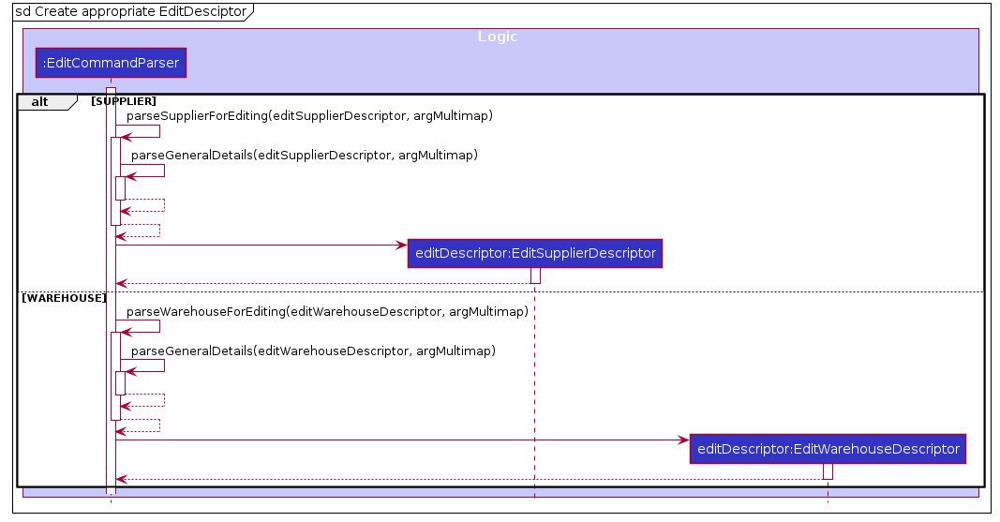

Parsing of general details will occur for both Supplier and Warehouse type. These include parsing of **`Name`**, **`Phone`** and **`Remarks`**.

This is represented in the sequence diagram below:

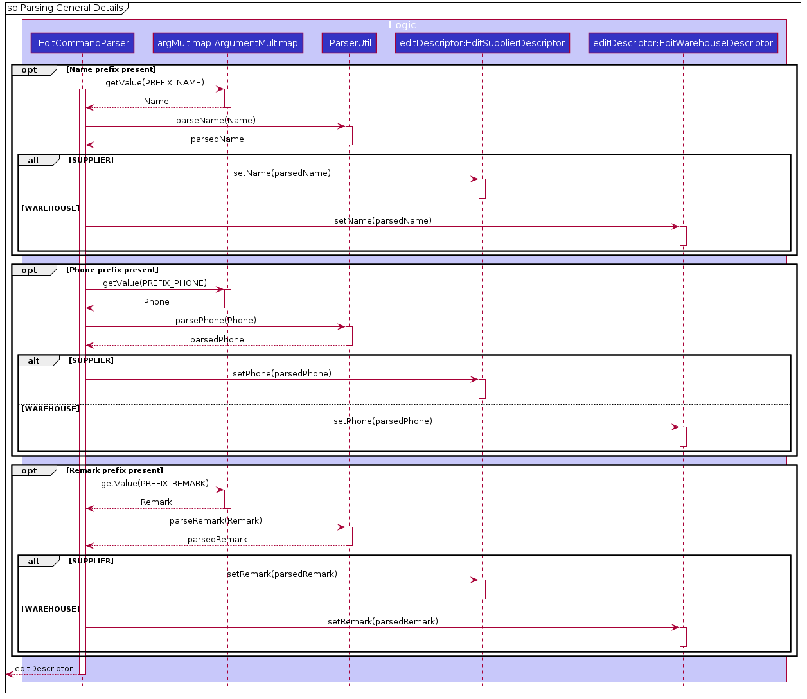

In addition, since Supplier contains an **`Email`** attribute, parsing of this field will be carried out. On the other hand, parsing of **`Address`** will be carried out for warehouse entity instead since they do not contain an **`Email`** attribute. These respective parsing are represented by the sequence diagrams below:

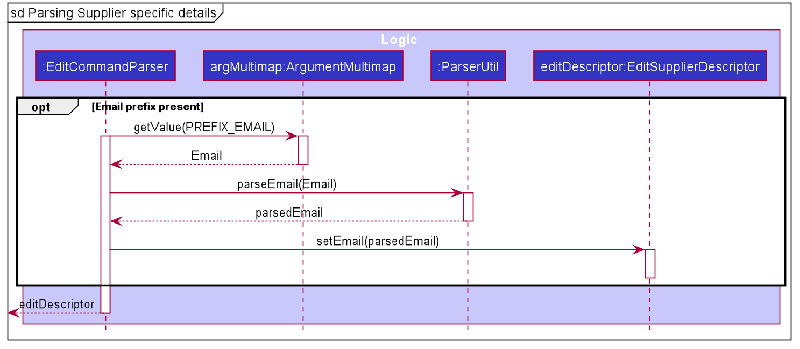

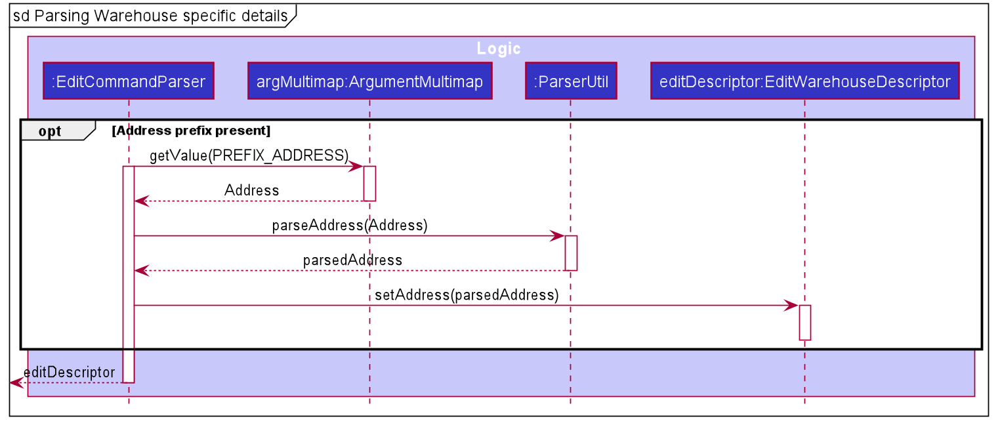

During this parsing process, **`ParseException`** will be thrown if any of the inputs are invalid.

At the end of parsing, if the type is a Supplier, an **`EditSupplierDescriptor`** will be created which will be used to instantiate an EditCommand. Similarly, if the type is a Warehouse, an **`EditWarehouseDescriptor`** will be created which will be used to instantiate an EditCommand.

EditCommand will be executed and the workflow is illustrated below:

The current list of suppliers or warehouses shown to user is first obtained from model. Afterwards, supplier or warehouse at the specified index will be retrieved.
A supplier with edited properties is created by invoking `createEditedSupplier` or `createdEditedWarehouse` method. If the model already contains a supplier or warehouse with the same name, an error will be thrown to inform user of the duplicated supplier or warehouse. **`Model`** will be updated to reflect the edited supplier or warehouse and an edit success message will be displayed to user, with the changes made to the relevant supplier/warehouse as well.

#### Why Edit feature is implemented this way
The `edit` command is implemented this way to ensure consistency with the other commands in the application. This helps to minimise any potential confusion for the users.

In addition, it was intended for **EditCommandParser** to throw out a **ParseException** when none of the field changes an existing entry. This serves as a reminder for users in case they made a minor mistake, resulting in a supplier or warehouse to not update the way they intended for it to.

Besides, a command type prefix, `ct/COMMAND_TYPE` is required in the implementation of `edit` command to indicate whether user wishes to edit a warehouse or supplier entry. Without this, an alternative would be for a `TYPE` parameter, where user have to indicate `supplier` or `warehouse`. However, this may not be suitable for our target user, who wishes to update stocks quickly.

Lastly, another alternative considered was to create separate commands for warehouses and suppliers respectively. For example, `editw` and `edits` to represent edit warehouse and edit supplier. However, this might increase duplicated codes, since minimal changes to the code would be found for each class of command.

Therefore, our team decided to implement `edit` command by taking in prefixes and throwing our relevant exceptions at appropriate points after considering code quality and end user experience.

### View feature
The `view` feature will be elaborated in this section by its' functionality and path execution with the aid of a sequence and an activity diagram.

#### What View feature does
`view` command allows user to view a particular warehouse or supplier in warehouse or supplier list displayed. This allows users to take a closer look at the contact details of a specific warehouse or supplier which they might be interested to contact for further details. For each command, only one warehouse or one supplier can be requested for viewing.

#### Path Execution of View Command
The workflow of an `view` command when it is executed by a user is shown in the activity diagram below:

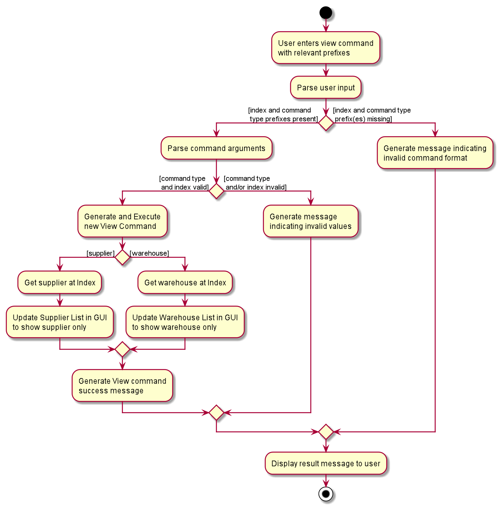

When a user's input is parsed, **`ViewCommandParser`** checks if both command type and index are present in the input. A **`ParseException`** will be thrown if either one or both are missing in user's input.

Only 2 command types are allowed, they are `ct/s` and `ct/w`. In addition, if any values for prefixes are invalid (e.g. invaid command type specified), a **`ParseException`** will be thrown.

If parsing is successful, **`ViewCommand`** will be created and executed. If the `INDEX` specified by user is greater than the length of the list, a **`ParseException`** will be thrown. At the end, a view command success message will be displayed and the relevant supplier or warehouse list will only show one supplier or warehouse.

The logical workflow of this process is further explained in the sequence diagram below:

Upon receiving user's input, parse command of **`ViewCommandParser`** will be invoked. Values associated with prefixes `ct/` and `i/` will be obtained by invoking `tokenize` method of **`ArgumentTokenizer`**. As mentioned above, if either or both prefixes are missing, an error will be thrown to inform the user of a missing prefix. When parsing `index` and `type` values, a **`ParseException`** will be thrown if the values specified are invalid (e.g wrong type or does not conform to `TYPE_CONSTRAINTS`). **`ViewCommand`** is created with `index` and `type` as input. It will then be executed.

The workflow for an execution of **`ViewCommand`** is as shown:

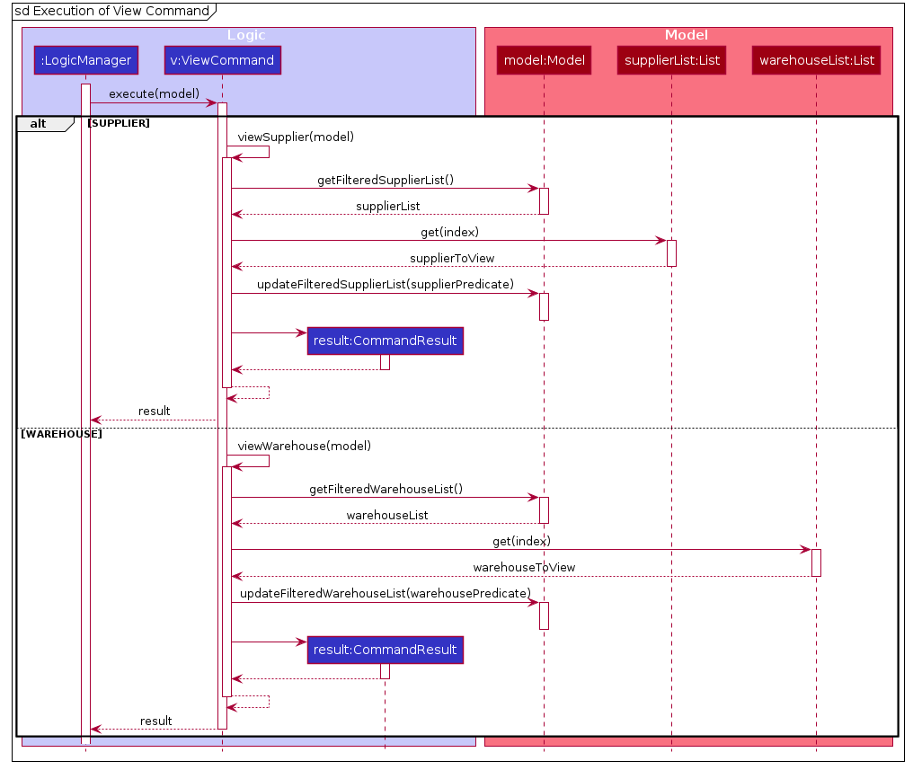

**`Supplier`** or **`Warehouse`** at the specified index is retrieved from `supplierList` or `warehouseList` respectively. Predicate containing the **`Supplier`** or **`Warehouse`** name will be created and parsed into `updateFilteredSupplierList` or `updateFilteredWarehouseList` method under **`Model`** class to show only a particular supplier or warehouse in the list. A successful execution of **`ViewCommand`** will also be displayed to user.

#### Why View feature is implemented this way
**`view`** command contains standardise prefix as with other commands in **CLI-nic** to help user learn how to use **CLI-nic** faster. In addition, a choice to view by `index` instead of by `name` ensures efficiency since users do not need to key in the full name of supplier or warehouse.

### Help feature
The `help` feature will be elaborated in this section by its' functionality.

#### What Help feature does
An activity diagram showing the workflow of `help` command is shown below:

`help` feature allows user to view `help` messages for all commands briefly or `help` message for specific commands. This allows user to have a over-arching idea of what they can do in **CLI-nic**. Afterwards, a user can read up about the command format and sample commands by typing in `help COMMAND`.

#### Why Help feature is implemented this way
Instead of providing a link and asking users to read the user guide, our team decided that it would be more convenient for users to access the help message for each command within the application itself. This allows user to instantly know what to key into the command box instead of switching between user guide in the browser and **CLI-nic**. In addition, this allows user to access `help` page even without an internet connection as well.

### List Suppliers and Warehouses feature
The list Suppliers and Warehouses feature will be elaborated in this section by its' functionality.

#### What List Supplier and Warehouses feature does
The list Suppliers and Warehouses feature allows user to list all suppliers and warehouses stored in **CLI-nic**. This feature allows users to retrieve back all suppliers and warehouses in the displayed supplier and warehouse lists after executing a `view` or `find` command.

### Find feature

#### What Find feature does
The find feature allows users to find all relevant suppliers or warehouses by their names, by their remarks and/or by
names of the products sold/stored. Users are able to search for relevant suppliers or warehouses using either only one
of these criterion or a combination of these criteria. Note that users are only able to search for either suppliers or
warehouses at any one time and not both at the same time.

#### How it is implemented
Step 1. After the `find` command is called, the user input will be sent to **FindCommandParser** for parsing.

Step 2. **FindCommandParser** will then check if the compulsory prefix `ct/COMMAND_TYPE` is present. If the user enters
`ct/COMMAND_TYPE` prefix more than once, only the last prefix specified will be used to process user's input. If the
prefix `ct/COMMAND_TYPE` is not present, a **ParseException** will be thrown.

Step 3. **FindCommandParser** will then proceed to check for the existence of at least one of the following prefixes
 `n/NAME`, `r/REMARK` and `pd/PRODUCT`. If none is found, a **ParseException** will be thrown. Again, if the user
 specifies the same prefix more than once, only the last prefix specified will be used to process the user's input.

Step 4. Once the user has entered the correct format for the command, their input will then be parsed.

Step 5. **FindCommandParser** will create a new **FindCommand** to be executed and the relevant suppliers or warehouses
will be filtered out.

Step 6. The model will then display the relevant suppliers or warehouses to the users via the method
`model#getFilteredSupplierList()` or `model#getFilteredWarehouseList()`.

#### Why it is implemented this way
The `find` command is implemented this way to ensure consistency with the other commands in the application regarding
the prefixes. This helps to minimise any potential confusion for the users by standardising the prefixes that `find`
command takes in with the other relevant commands. In addition, a command type prefix, `ct/COMMAND_TYPE` is required in the
implementation of `find` command to indicate whether the user wishes to search for suppliers or warehouses. Without this
prefix, the application will not be able to know if the user wishes to search for suppliers or warehouse.

#### Alternatives considered
In our previous implementation, we did not require the user to enter the command type prefix. Instead, we only required
the user to enter the `TYPE` parameter in the form of either `supplier` or `warehouse`. However, typing the whole word
out may not have been suitable for our target user, who wishes to find suppliers or warehouses quickly. Hence, our team
decided to use a command type prefix in place of a `TYPE` parameter, which is shorter and easier to type.

In our current implementation, users are required to enter at least one or a combination of the following prefixes:
`n/NAME`, `r/REMARK`, `pd/PRODUCT`. This allows the application to determine which criterion/criteria to filter by.
Another alternative that was previously implemented was to split the find command into three separate commands: `findn`
which allows users to search by name, `findr` which allows users to search by remarks and `findp` which allows users to
search by products. However, this implementation was deemed unsuitable as it increased code duplication with minimal
changes between the different classes. In addition, by splitting into three separate commands, users are unable to
search for suppliers or warehouses using multiple criteria. They could only search by name, by remark or by product in
any single command. By using prefixes, users are able to search for suppliers or warehouses using any combination of
name, remark and product. Taking the aforementioned points into consideration, our team has therefore decided to
implement the `find` command by taking in prefixes and throwing our relevant exceptions at appropriate points after
considering code quality and end user experience.

### Update product feature

#### What the update product feature does

The update product feature allows users to modify the quantity or tags of existing products listed under suppliers and warehouses, or add new products to their existing lists.

#### How it is implemented
The update product mechanism is facilitated by 3 major components: `UpdateCommandParser`, `UpdateCommand`, and the `UpdateProductDescriptor`.
`UpdateCommandParser`'s job is to parse the user input to generate the correct `Type`, `Name`, `Index`, and `AssignMacroDescriptor` objects for the `UpdateCommand`.
`UpdateCommand`'s job is to execute the main logic for generating the updated list of products for the model.
`UpdateProductDescriptor`'s job is to serve as a medium to allow the `UpdateCommandParser` to pass a specification of the updated product to the `UpdateCommand`.

Given below is an example usage scenario, together with a sequence diagram, to show how the update product mechanism behaves at each step.

Step 1. The user decides to update the stock for a product called 'Panadol' with a new quantity of 50 units
in the warehouse named 'Jurong Warehouse'. The user also decides that he wants to give 'Panadol' a tag 'fever'.
The user does this by executing the `update ct/w n/Jurong Warehouse pd/Panadol q/50 t/fever` command.
The input string will then be passed to the `UpdateCommandParser`.

Step 2. By matching the prefixes provided, `UpdateCommandParser#parse` then attempts to create new instances of `Index` for the supplier/warehouse
and a new `Name` for the product. A new `UpdateProductDescriptor` will then be created with the provided quantity and tags, if any. An exception will be thrown if any of the arguments are invalid, or if the type and names of the supplier/warehouse and product are not supplied. If so, an error message will be presented on the GUI.
Otherwise, the method will create an `UpdateCommand` with the `Type`, warehouse/supplier and product's `Name`, and the `UpdateProductDescriptor`.

The following sequence diagram zooms in on how the `UpdateCommand#execute` is implemented:
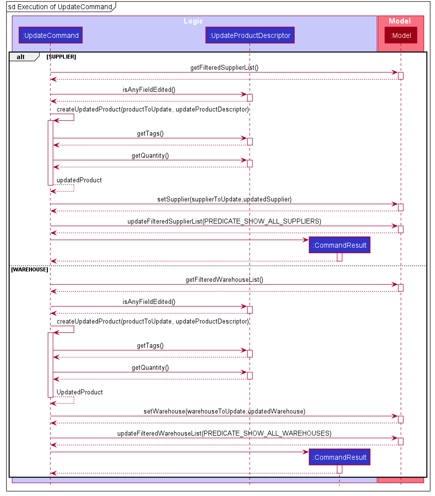

Step 3. `UpdateCommand#execute` is then called with the `Model` instance. The method then attempts to retrieve the warehouse/supplier from the model with the supplied name. If it is not found, `NoSuchElementException` is thrown, otherwise, the `UpdateCommand#execute`
method copies the existing product set for that warehouse/supplier to a new `Set<Product>`.

Step 4. `UpdateCommand#execute` then checks if a `Product` of the same `Name` as the `Product` to be updated exists in the `Set<Product>`.
If the `Product` exists, the method does an additional check to ensure that either the tag(s) or quantity (or both)
is supplied in the `UpdateProductDescriptor`, failing which, an exception is thrown. If the check passes, the original
`Product` is removed from the set.

Step 5. `UpdateCommand#createUpdatedProduct` then creates a new product based on the product name and `UpdateProductDescriptor`. The `execute` method then adds the updated `Product` to the `Set<Product>`, and creates an updated
warehouse/supplier with the updated product. The method then updates the model with the edited warehouse/supplier, and the `FilteredWarehouseList` to be displayed to the user.
The method then passes a `CommandResult` with a success message back to the `LogicManager`. Finally, the model
is saved and the GUI is updated with the success message.

The following activity diagram summarizes what happens when a user updates a product:

#### Why it is implemented this way and what alternatives were considered
The main design considerations associated to the feature include:

* Should the command be separated for suppliers and warehouses.
* What should the format of the command be.
* Should the adding of new products be facilitated by this command or should it only deal with existing products.
* How should the feature enforce separate requirements for new and existing products.

The consideration of whether there should be separate commands to update products under warehouses or suppliers firstly depend on the similarity between the products under both types.
Initially, we considered that supplier products should only have fields for names and tags, while the warehouse products should only have fields for quantities, as it is arguable that the quantity for suppliers 
may not be known, and that tagging of warehouse products may not be very important. However, we later decided that it is better to give users this flexibility to include any 
tags or quantities associated to the product regardless of supplier or warehouse, as these requirements may differ from user to user, and it may not be beneficial to restrict users as such. 
Then this decision would mean that the updating of products for warehouse and supplier was very similar, and hence we felt that it may also be more user-friendly to combine the 2 into 
one command so that users do not need to learn an additional command.

Initially, the supplier/warehouse to update the product was referenced by the user using the warehouse/supplier's full name. This allowed the user to update the specific supplier/warehouse regardless of the list view
so that the same update command will reproduce the same results regardless of the display, and so that the user does not have to enter an additional list command if the supplier/warehouse is not presently displayed.
However, this would mean that if the user is manually typing the command, it would be take a long time to enter the command if the supplier/warehouse name is very long, and it is also more prone to typos. Hence we decided
to make the compromise to use list indexing instead, standardising the format with the other commands, as we felt that for most use cases, using the index to reference the supplier/warehouse would be more efficient for the user, 
and that was our main priority.

Similar to the decision to combine the command for both supplier and warehouse, we decided to allow the update product command to add the product to the warehouse/supplier even if it does not presently exist for that supplier/warehouse, instead of having a separate command
just for adding products, so as to minimise the total number of commands. With this, all product additions and modifications (excluding deletion) will be processed by the same update command, which also removes the need for users to
check if a product exists for a supplier/warehouse before updating the product listing.

This combination of commands, however, brings up the consideration of how to enforce the separate requirements for new and existing products. Specifically, if it is a new product,
it is logical that the user may not supply the tag or quantity prefixes, but if it is an existing product, then not specifying both prefixes would mean that the user is not performing
any update at all. Hence the user should be required to supply at least 1 of the 2 optional prefixes mentioned above for adding new products, which would mean the application should show an error message if the user does not specify either of the optional arguments
and the product does not exist under the specified warehouse/supplier in the model. In general, however, the check of whether certain prefixes are supplied falls under the role of the `Parser` classes,
while the check of whether an entity exists in the model falls under the role of the `Command` classes, where the `Parser` is independent of the model. Hence we decided to implement an additional `UpdateProductDescriptor` class to provide a wrapper of
the product specification so that both checks can be done by the `UpdateCommand` without exposing the implementation details of the prefixes to the `UpdateCommand` class or using null values in the `UpdateCommand` fields. The `UpdateCommand` can then use the `UpdateProductDescriptor`
to both execute the checks and create the updated product.

### Assign macro feature

#### What the assign macro feature does

The assign macro feature allows users to be able to create their own alias for a specific command string which can be used to enter commands after the macro is saved.

#### How it is implemented

The assign macro mechanism is facilitated by 2 components: `AssignMacroCommandParser` and `AssignMacroCommand`.
`AssignMacroCommandParser`'s job is to parse the user input to generate the correct `Alias` and `SavedCommandString`  objects for the `AssignMacroCommand`.
`AssignMacroCommand`'s job is to execute the main logic for updating the model with the new macro.

Given below is an example usage scenario, together with a sequence diagram, to show how the assign macro mechanism behaves at each step.
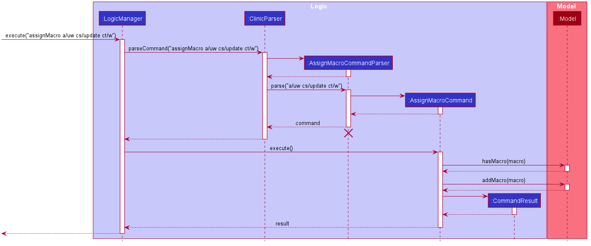

Step 1. The user frequently updates a specific warehouse and decides to create a new macro with the alias "uwm" for the command string "update ct/w n/MainWarehouse" so as to shorten subsequent command inputs.
The user does this by executing the `assignmacro a/uwm cs/update ct/w n/MainWarehouse` command. The input string will then be passed to the `AssignMacroCommandParser`.

Step 2. By matching the prefixes provided, `AssignMacroCommandParser#parse` then attempts to create a new instances of `Alias` and `SavedCommandString` after matching the prefixes, and throws
an exception to be displayed on the GUI if the alias or command string supplied by the user is invalid, or if any of them is not supplied at all. If all prefixes are parsed without error,
a `Macro` is created from the `Alias` and `SavedCommandString` instances. Then, a new `AssignMacroCommand` instance is created with the new `Macro`.

Step 3. The `AssignMacroCommand#execute` method will then be called with the `model` instance. The method will first check if there is any existing macro in the model that uses the same alias.
If that is true, an exception will be thrown. This will be shown on the GUI as an error message. Otherwise, the new macro will be added to the model.

Step 4. The `AssignMacroCommand#execute` then passes a `CommandResult` with a success message back to the `LogicManager`. Finally, the model is saved and the GUI is updated with the success message.
The user now updates the quantity of the product "Panadol" in the aforementioned warehouse by simply executing the command `uwm pd/Panadol`.

The following activity diagram summarizes what happens when a user assigns a macro:

### Remove Macro feature

#### What the remove macro feature does

The remove macro feature allows users to be able to remove an existing macro with a specific alias.

#### How it is implemented

The remove macro mechanism is facilitated by 2 components: `RemoveMacroCommandParser` and `RemoveMacroCommand`.
`RemoveMacroCommandParser`'s job is to parse the user input to generate the correct `Alias` objects for the `RemoveMacroCommand`.
`RemoveMacroCommand`'s job is to execute the main logic for updating the model with the specified macro removed.

Given below is an example usage scenario, together with a sequence diagram, to show how the remove macro mechanism behaves at each step.

Step 1. The user decides that he/she no longer needs the macro with the alias "uwm" and decides to remove it. He does this by executing the `removemacro uwm` command.
The input string will then be passed to the `RemoveMacroCommand parser`.

Step 2. By matching the prefixes provided, `RemoveMacroCommandParser#parse` then attempts to create a new instance of `Alias` by parsing the arguments provided. If the `Alias` is
invalid, an exception will be thrown which will be shown as an error message on the GUI. Otherwise, a `RemoveMacroCommand` instance is created with the new `Alias`.

Step 3. `RemoveMacroCommand#execute` is then called with the model instance, which first attempts to retrieve the existing macro in the model with the `Alias` specified by calling the `model#getMacro` method.
This macro is returned in an optional wrapper, and an exception will be thrown if it is empty, where an error message will be displayed on the GUI. Otherwise, the
retrieved macro will be removed from the model.

Step 4. The `RemoveMacroCommand#execute` then passes a `CommandResult` with a success message back to the `LogicManager`. Finally, the model is saved and the GUI is updated with the success message.

The following activity diagram summarizes what happens when a user updates a product:
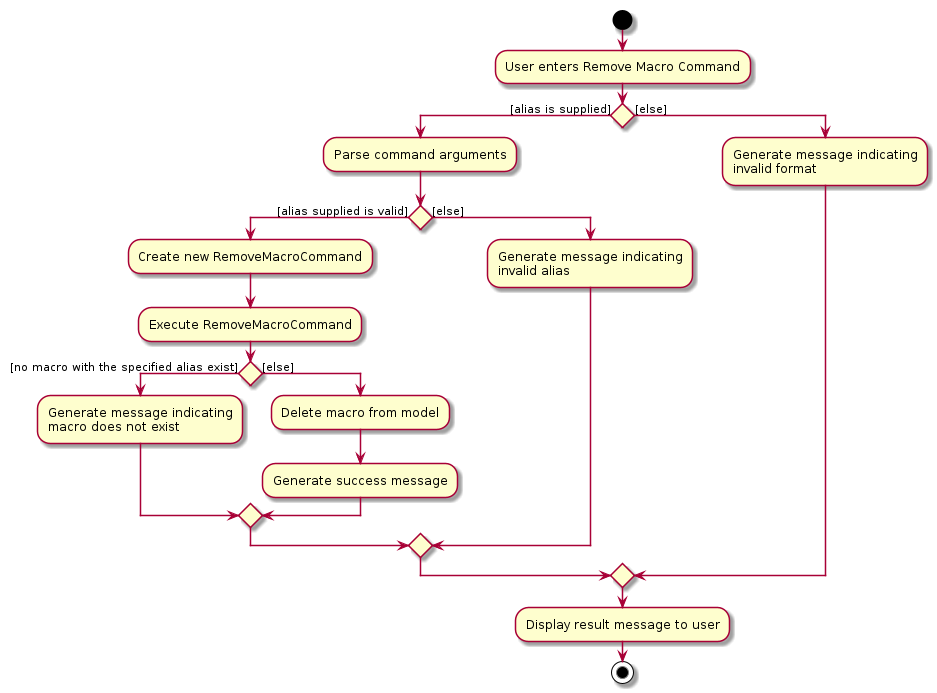

### List Macros feature

#### What the List macros feature does

The list macros feature allows users to be able to view all presently saved macros in the application.

#### How it is implemented

The list macros feature is facilitated by the ListMacroCommand, which retrieves the internal macro list and create a presentable format for displaying the list.
If no macros are found, an exception is thrown which results in a message displayed on the GUI notifying the user that there are no presently saved macros.
Otherwise, the success message which contains the formatted list will be passed in a `CommandResult` to the `LogicManager`, to be displayed on the GUI without overriding the existing lists for suppliers and warehouses.

#### Why it is implemented this way

The main implementation consideration of this feature would be the display of the list. The list macros feature was implemented such that it does not use the same display section as the warehouse or supplier lists so that the user would not have to execute and additional command to restore the
supplier or warehouse lists. I decided not to include a separate display section to display the list of macros either as this feature is designed for advanced users and that the list of macros would not need to be displayed on
screen except when needed. Hence it is implemented such that it will be displayed with the success message instead, so that the user can quickly refer to the macro list and then proceed to use the intended macro straight after, where
it would then be no longer necessary to keep the macro list on the display.

### Add Supplier/Warehouse feature
In this section, the functionality of the add feature, the expected execution path, the structure of
the AddCommand class, the interactions between objects with the AddCommand object will be discussed.

#### What is the Add Supplier/Warehouse feature
The add supplier/warehouse feature is facilitated by the `AddCommandParser` and the `AddCommand`.
The `AddCommandParser` implements `Parser` and the `AddCommand` extends `Command`, allowing the user to
add a supplier/warehouse to the app using the command line.

The supplier consists of : Type, Name, Phone, Email

The warehouse consists of : Type, Name, Phone, Address

The supplier/warehouse also consists of one optional field that can be added:
* Remark

#### Path Execution of Add Command
The overview of the AddCommand Activity Diagram is shown below:

After the user calls the Add command, the code will check for the presence of all the compulsory prefixes
in the command. The code will throw a ParseException if there are any missing/invalid prefixes. After that is
checked, it will check if the new supplier/warehouse added is a duplicate (The supplier/warehouse already
exist in the application). It will throw a CommandException when the user tries to add a duplicate
order. Otherwise, it will add the supplier/warehouse and prints a success message to the user.

#### Structure of Add feature
The following diagram shows the overview of the AddCommand Class Diagram:

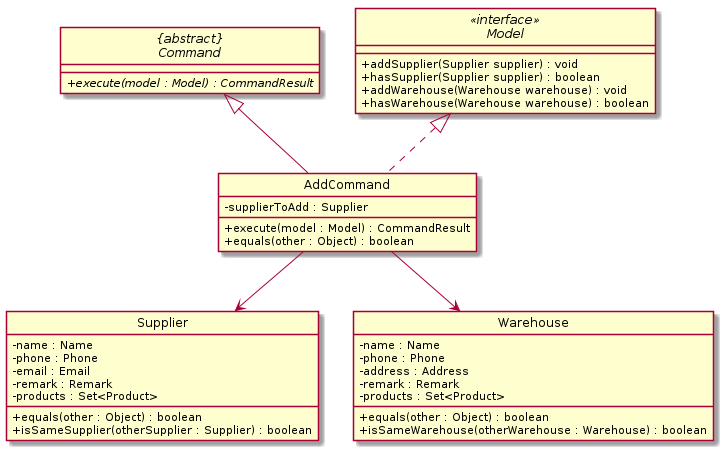

The above class diagram shows the structure of the AddCommand and its associated classes and interfaces. Some
methods and fields are not included because they are not extensively utilised in AddCommand; such as public
static fields and getter/setter methods.

#### Interaction between objects when the Add Command is executed
The sequence for adding supplier and warehouse is similar, here is the sequence diagram for the Add Command
for supplier as shown below:

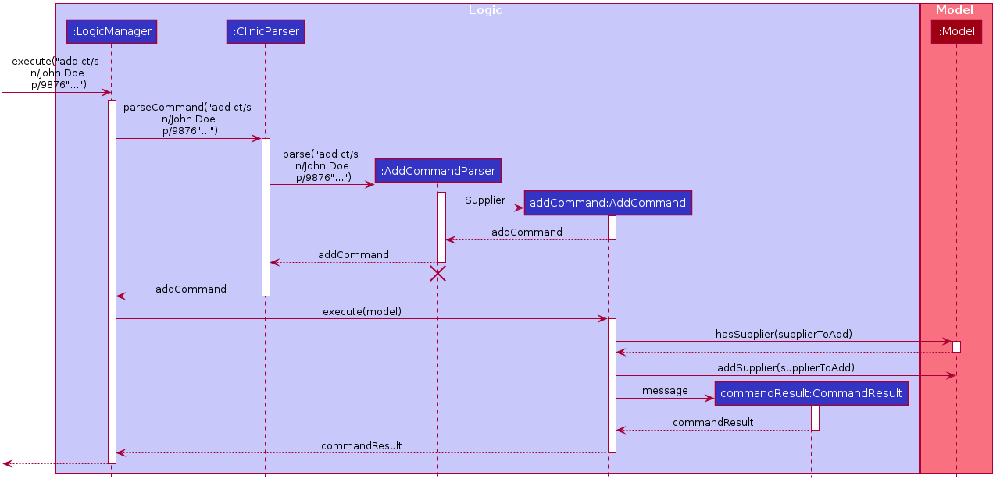

The arguments of the add command will be parsed using the parse method of the AddCommandParser class.
The AddCommandParser will tokenize the arguments parsed in using the tokenize method of ArgumentTokenizer
class which returns the tokenized arguments. Using the tokenized arguments, the Parser will check if the
arguments parsed in matches with the tokenized arguments using the arePrefixesPresent method.

There are two scenarios :

1. Some compulsory prefixes are not present :

   AddCommandParser will throw a new ParseException object to the LogicManager.

1. All compulsory prefixes are present in the arguments :

   It will then proceed to use the getValue method of the ArgumentMultimap class to get the value of the
   prefixes. For example, if the argument parsed in is ct/s, the getValue method will get the value 's'.
   Subsequently, it will use the ParseUtil methods to get the corresponding object values and put it into
   the parameters of the new Supplier/Warehouse object. The Supplier/Warehouse object will be put into the
   parameter of the AddCommand object and this will be returned to the LogicManager class for execution.

   LogicManager will then call the execute() method of this AddCommand object. In the execute() method, it will
   use the Model class to call hasSupplier/hasWarehouse method to check for duplicates, if it is a duplicate, the
   order will throw a CommandException which indicates that there is a duplicate supplier/warehouse in the CLI-nic
   application already. Else, it will successfully add the new supplier/warehouse using addSupplier/addWarehouse
   method. Finally, it return a new CommandResult object, containing a String that indicates a successful
   addition.

### Undo/redo feature

The implementation of undo/redo takes reference from the AddressBook3's proposed implementation, with some modification
on the storage of versioned data.

#### Implementation

The current undo/redo mechanism is facilitated by `VersionedClinic`.
It extends `Clinic` with an undo/redo history, stored internally via `undoVersionStack` and `redoVersionStack`.
It also stores a `currentClinic` to facilitate the storing of current version of data into the correct stack.
Additionally, it implements 3 other major operations:

* `VersionedClinic#save()` — Saves the current CLI-nic version in its history.
* `VersionedClinic#undo()` — Recovers the previous CLI-nic version from its history.
* `VersionedClinic#redo()` — Restores a previously undone CLI-nic version from its history.

These operations are exposed in the `Model` interface as `Model#saveVersionedClinic()`, `Model#undoVersionedClinic()` and `Model#redoVersionedClinic()` respectively.

Given below is an example usage scenario and how the undo/redo mechanism behaves at each step.

Step 1. The user launches the application for the first time. The `VersionedClinic` will be initialized with the initial CLI-nic state, and the `currentClinic` pointing to that single CLI-nic state.

Step 2. The user executes `delete ct/w i/2` command to delete the 2nd warehouse in the displayed warehouse list.  
The `delete` command then calls `Model#saveVersionedClinic()`, causing the CLI-nic version prior to the warehouse deletion (i.e. the `currentClinic`) to be saved in the `undoVersionStack`, and the `currentClinic` is now updated to the newly modified version.

Step 3. The user executes `add ct/s n/David Co …​` to add a new supplier.  
The `add` command also calls `Model#saveVersionedClinic()`, causing the `currentClinic` version to be saved into the `undoVersionStack` again and updated to the newly modified version.

:information_source: **Note:** If a command fails its execution, it will not call `Model#saveVersionedClinic()`, so the `currentClinic` will not be saved into the `undoVersionStack` and updated.

Step 4. The user now decides that adding the supplier was a mistake, and decides to undo that action by executing the `undo` command.  
The `undo` command will call `Model#undoVersionedClinic()`. The `undoVersionStack` will pop the most recent version of CLI-nic data stored, recovers the CLI-nic to that version.  
The `currentClinic` version will be stored in `redoVersionStack` and set to this most recent version popped.

:information_source: **Note:** If the `undoVersionStack` is empty, suggesting to the initial CLI-nic version, then there are no previous CLI-nic version to recover. The `undo` command uses `Model#canUndoClinic()` to check if this is the case. If so, it will return an error to the user rather
than attempting to perform the undo.

The following sequence diagram shows how the undo operation works:

:information_source: **Note:** The lifeline for `UndoCommand` should end at the destroy marker (X) but due to a limitation of PlantUML, the lifeline reaches the end of diagram.

The `redo` command does the opposite — it calls `Model#redoClinic()`, which pops the most recent undone version of CLI-nic data from `redoVersionStack` and recovers the CLI-nic to that version.
Correspondingly, the `currentClinic` version will be stored in `undoVersionStack` and set to this most recent undone version popped.

:information_source: **Note:** If the `redoVersionStack` is empty, suggesting to the latest CLI-nic version, then there are no undone CLI-nic version to restore.
The `redo` command uses `Model#canRedoClinic()` to check if this is the case. If so, it will return an error to the user rather than attempting to perform the redo.

Step 5. The user then decides to execute the command `list`.  
Commands that do not modify the CLI-nic data, such as `list`, will not call `Model#saveVersionedClinic()`, `Model#undoVersionedClinic()` or `Model#redoVersionedClinic()`.
Thus, the `undoVersionStack`, `redoVersionStack` and `currentClinic` remain unchanged.

Step 6. The user executes `clear`, which calls `Model#saveVersionedClinic()`.  
Note here all CLI-nic versions stored the `redoVersionStack` will be purged. Reason: It no longer makes sense to redo the `add ct/s n/David Co …​` command. This is the behavior that most modern desktop applications follow.

:information_source: **Note:** It is common practice to remove any redoable version of data after each editing on the current data. For example, type `test` in any .txt file, undo once and type `new` again. Then trying to redo the previous undone text editing will not work.

The following activity diagram summarizes what happens when a user executes a new command:

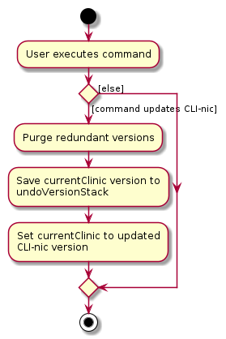

#### Design consideration:

#### Aspect: How undo & redo executes

* **Alternative 1 (current choice):** Saves the entire CLI-nic into two stacks for undo and redo.
  * Pros: Easy to implement.
  * Cons: May have performance issues in terms of memory usage.

* **Alternative 2:** Individual command knows how to undo/redo by
  itself.
  * Pros: Will use less memory (e.g. for `delete`, just save the warehouse/supplier being deleted).
  * Cons: We must ensure that the implementation of each individual command are correct.

--------------------------------------------------------------------------------------------------------------------

## **Documentation, logging, testing, configuration, dev-ops**

* [Documentation guide](Documentation.md)
* [Testing guide](Testing.md)
* [Logging guide](Logging.md)
* [Configuration guide](Configuration.md)
* [DevOps guide](DevOps.md)

--------------------------------------------------------------------------------------------------------------------

## **Appendix: Requirements**

### Product scope

**Target user profile**:

* manager of a medical supplies company that manages warehouses across the country
* tech-savvy manager who prefers typing to clicking
* keeps track of supplies in each warehouse
* needs to quickly contact suppliers to restock medical supplies when the stock runs low at various warehouses

**Value proposition**:

* manages suppliers/warehouses information conveniently
* helps to retrieve and identify key suppliers/warehouses information quickly

### User stories

Priorities: High (must have) - `* * *`, Medium (nice to have) - `* *`, Low (unlikely to have) - `*`

| Priority | As a …​                                 | I want to …​                | So that I can…​                                                        |
| -------- | ------------------------------------------ | ------------------------------ | ------------------------------------------------------------------------- |
| `* * *`  | standard user  | add my suppliers' information and products offered | easily refer to the contacts and give them a call for updates on their supply availability     |
| `* * *`  | standard user  | add details of warehouses and stocks for each product | easily keep track of the stocks in each of my warehouse |
| `* * *`  | standard user  | add remarks to a supplier entry         | note down details that are specific to the supplier          |
| `* * *`  | standard user  | access the command list/user guide  | easily refer to instructions for commands and guidance for usage    |
| `* * *`  | standard user  | clear all suppliers and warehouses entries in one command | easily remove all entries if I am managing a new group of suppliers and warehouses |
| `* * *`  | standard user  | delete a supplier/warehouse entry   | remove suppliers/warehouses no longer operating |
| `* * *`  | standard user  | delete a particular product from a supplier/warehouse entry   | remove product no longer sold/stored for the supplier/warehouse|
| `* * *`  | standard user  | edit the information of a specific warehouse or supplier          | easily update any changes in contact information of a particular supplier/warehouse |
| `* * *`  | standard user  | find medical products associated with warehouses or suppliers     | locate relevant items without having to go through all the lists                |
| `* * *`  | standard user  | list all warehouses or suppliers     | easily see all the suppliers and warehouses I am in charge of|
| `* * *`  | standard user  | view the information of a specific warehouse or supplier          | retrieve details about the supplier/warehouse I can't remember and contact them       |
| `* * *`  | standard user  | view the products of a specific warehouse          | retrieve products associated with the warehouse to see if restocking is needed   |
| `* * *`  | standard user  | view the products of a specific supplier        | retrieve products associated with the supplier to see if they have enough stocks for me to place an order   |
| `* * *`  | standard user  | Undo my previous editing on the data    | fix any wrong entry into the data if I've done so by mistake|
| `* * *`  | standard user  | redo my previous undone editing on the data    | recover the undone editing earlier if I want those editing back|
| `* * * ` | intermediate user | update the information for a specific product in warehouses and suppliers | keep track of the changes in the stocks of the warehouses |
| `* *`    | advanced user | create custom alias for my commands | so that I enter commands more efficiently |
| `* *`    | advanced user | delete a custom alias | remove the aliases that I no longer need |
| `* *`    | advanced user | list my saved macros | quickly recall which macros I can currently use  |

### Use cases

(For all use cases below, the **System** is the `CLI-nic` and the **Actor** is the `user`, unless specified
 otherwise)

**Use case: UC01 Add a warehouse**

**MSS**

1. User keys in command to add a warehouse.
2. CLI-nic adds the warehouse into the list and shows a success message.

    Use case ends.

**Extensions**

* 1a. CLI-nic detects invalid syntax in the entered warehouse info.

  * 1a1. CLI-nic shows an error message.
  * 1a2. CLI-nic requests for the correct syntax of warehouse info.
  * 1a3. User enters new data.

    Steps 1a1-1a3 are repeated until the data entered are valid.  
    Use case resumes from step 2.

* 1b. CLI-nic detects addition of duplicated warehouse.

  * 1b1. CLI-nic shows duplicated warehouse message.
  * 1b2. CLI-nic requests for a different warehouse.
  * 1b3. User enters new data.

    Steps 1b1-1b3 are repeated until the data entered are valid.  
    Use case resumes from step 2.

**Use case: UC02 Add a supplier**

**MSS**

1. User keys in command to add a supplier.
2. CLI-nic adds the supplier into the list and shows a success message.

    Use case ends.

**Extensions**

* 1a. CLI-nic detects an error in the entered supplier info.

  * 1a1. CLI-nic shows an error message .
  * 1a2. CLI-nic requests for valid data.
  * 1a3. User enters new data.

    Steps 1a1-1a3 are repeated until the data entered are valid.  
    Use case resumes from step 2.

**Use case: UC03 Assign a macro**

**MSS**

1. User keys in command to assign a macro with an alias and a command string to be saved.
2. CLI-nic saves the macro and shows a success message.

    Use case ends.

**Extensions**

* 1a. The alias or command string supplied is invalid.

  * 1a1. CLI-nic shows an error message with the constraints for the fields required.
  * 1a2. User enters a new command.

    Steps 1a1-1a2 are repeated until the data entered is valid.  
    Use case resumes from step 2.

* 1b. The command supplied is not in the valid format.

  * 1b1. CLI-nic shows an error message and the valid format, along with examples of the valid usage.
  * 1b2. User enters a new command.

    Steps 1b1-1b2 are repeated until the command format is valid.  
    Use case resumes from step 2.

* 1c. An existing macro with the same alias as the one supplied is found.

  * 1c1. CLI-nic shows an error message, notifying the user of the conflict.
  * 1c2. User enters a new command with a new alias.

    Steps 1c1-1c2 are repeated until the alias supplied does not already exist in CLI-nic.  
    Use case resumes from step 2.

**Use case: UC04 Clear all supplier and warehouse entries**

**MSS**

1. User requests to clear the data in the application.
2. CLI-nic clears all supplier and warehouse entries, shows empty lists of suppliers and warehouses and shows a success message.

    Use case ends.

**Use case: UC05 Delete a supplier**

**MSS**

1. User requests to view a specific supplier by keyword.
2. CLI-nic shows the specific supplier and its index.
3. User deletes the supplier via its index in the list.
4. CLI-nic deletes the supplier in the list and shows a success message.

    Use case ends.

**Extensions**

* 2a. The supplier list is empty.

  * 2a1. CLI-nic informs the user there is no supplier in the list currently.

    Use case ends.

* 3a. The given index is invalid.

  * 3a1. CLI-nic shows an error message and gives command suggestions.
  * 3a2. User enters the new supplier index.

    Steps 3a1-3a2 are repeated until the data entered are valid.  
    Use case resumes at step 4.

**Use case: UC06 Delete a warehouse**

**MSS**

1. User requests to view a specific warehouse by keyword.
2. CLI-nic shows the specific warehouse and its index.
3. User deletes the warehouse via its index in the list.
4. CLI-nic deletes the warehouse in the list and shows a success message.

    Use case ends.

**Extensions**

* 2a. The warehouse list is empty.

  * 2a1. CLI-nic informs the user there is no warehouse in the list currently.

    Use case ends.

* 3a. The given index is invalid.

  * 3a1. CLI-nic shows an error message and gives command suggestions.
  * 3a2. User enters the new warehouse index.

    Steps 3a1-3a2 are repeated until the data entered are valid.
    Use case resumes at step 4.

**Use case: UC07 Delete a product from a supplier**

**MSS**

1. User requests to view a specific supplier by keyword.
2. CLI-nic shows the specific supplier and its index.
3. User requests to delete a product from the supplier via the index returned and the product name displayed.
4. CLI-nic deletes the specified product from the target supplier and shows a success message.

    Use case ends.

**Extensions**

* 2a. The supplier list is empty.

  * 2a1. CLI-nic informs the user there is no supplier in the list currently.

    Use case ends.

* 3a. The given index is invalid.

  * 3a1. CLI-nic shows an error message and gives command suggestions.
  * 3a2. User enters the new supplier index.

    Steps 3a1-3a2 are repeated until the index entered is valid.  
    Use case resumes at step 4.

* 3b. The given name is invalid.

  * 3b1. CLI-nic shows an error message and gives command suggestions.
  * 3b2. User enters the new product name.

    Steps 3b1-3b2 are repeated until the name entered is valid.  
    Use case resumes at step 4.

**Use case: UC08 Edit a supplier**

**MSS**

1. User requests to edit a specific supplier according to the index in the supplier list displayed.
2. CLI-nic shows the specific supplier at that index.

    Use case ends.

**Extensions**

* 1a. The index specified is larger than the size of the supplier list.

  * 1a1. CLI-nic informs the user the index input is larger than the current size of supplier list displayed.
  * 1a2. User enters a new supplier index.

    Steps 1a1-1a2 are repeated until the index entered is within the size of the supplier list.

    Use case ends.

* 1a. User requests to edit the address of a specific supplier.

  * 1a1. CLI-nic informs the user that warehouse does not contain address.
  * 1a2. User removes address as a field to be edited.

    User case ends.

* 1a. User uses an invalid command format.

  * 1a1. CLI-nic informs user of the invalid command format.
  * 1a2. User enters a new edit command.

    Steps 1a1-1a2 are repeated until the index entered is valid.

    Use case ends.

**Use case: UC09 Edit a warehouse**

**MSS**

1. User requests to edit a specific warehouse according to the index in the warehouse list displayed.
2. CLI-nic shows the specific warehouse at that index.

    Use case ends.

**Extensions**

* 1a. The index specified is larger than the size of the warehouse list.

  * 1a1. CLI-nic informs the user the index input is larger than the current size of warehouse list displayed.
  * 1a2. User enters a new warehouse index.

    Steps 1a1-1a2 are repeated until the index entered is within the size of the warehouse list.

    Use case ends.

* 1a. User requests to edit the email address of a specific warehouse.

  * 1a1. CLI-nic informs the user that warehouse does not contain email address.
  * 1a2. User removes email address as a field to be edited.

    User case ends.

* 1a. User uses an invalid command format.

  * 1a1. CLI-nic informs user of the invalid command format.
  * 1a2. User enters a new edit command.

    Steps 1a1-1a2 are repeated until the index entered is valid.

    Use case ends.

**Use case: UC10 Find Suppliers of a product**

**MSS**

1. User enters the command to find the suppliers of a specific product.
2. CLI-nic displays all suppliers that sells the product if any.
3. User scrolls through all the relevant results and looks for the information that they desire.

    Use case ends.

**Extensions**

* 1a. User enters invalid command for finding.

  * 1a1. CLI-nic requests for the valid command.
  * 1a2. User enter a new command for finding.

    Steps 1a1 and 1a2 are repeated until a valid find command is entered.  
    Use case resumes at step 2.

**Use case: UC11 Find Warehouses containing a product**

**MSS**

1. User enters the command to view a particular product stored in all warehouses.
2. CLI-nic displays all the relevant products that are stored in the warehouses if any.
3. User scrolls through all the relevant results and looks for the information that they desire.

    Use case ends.

**Extensions**

* 1a. User enters invalid command for finding.

  * 1a1. CLI-nic requests for the valid command.
  * 1a2. User enter a new command for finding.

    Steps 1a1 and 1a2 are repeated until a valid find command is entered.  
    Use case resumes from step 2.

**Use case: UC12 List all supplier and warehouse entries**

**MSS**

1. User requests to list the supplier and warehouse data in the application.
2. CLI-nic retrieves all supplier and warehouse entries, shows lists of suppliers and warehouses and shows a success message.

    Use case ends.
    
**Use case: UC13 List all macros**

**MSS**

1. User requests to list the macros saved in the application.
2. CLI-nic retrieves all presently saved macros, and shows it on the GUI.

    Use case ends.
  
**Extensions**

* 1a. There are no presently saved macros.

  * 1a1. CLI-nic shows a message to notify the user that no macros were found.

    Use case ends.

**Use case: UC13 Remove a macro**

**MSS**

1. User keys in command to remove a macro with a specified alias.
2. CLI-nic removes the macro and shows a success message.

    Use case ends.

**Extensions**

* 1a. The alias supplied is invalid.

  * 1a1. CLI-nic shows an error message with the constraints for the alias specified.
  * 1a2. User enters a new command.

    Steps 1a1-1a2 are repeated until the alias entered is valid.  
    Use case resumes from step 2.

* 1b. The command supplied is not in the valid format.

  * 1b1. CLI-nic shows an error message and the valid format, along with examples of the valid usage.
  * 1b2. User enters a new command.

    Steps 1b1-1b2 are repeated until the command format is valid.  
    Use case resumes from step 2.

* 1c. An existing macro with the alias supplied cannot be found.

  * 1c1. CLI-nic shows an error message, notifying the user that the macro does not exist.
  * 1c2. User enters a new command with another alias.

    Steps 1c1-1c2 are repeated until a macro with the new alias supplied is found.  
    Use case resumes from step 2.

**Use case: UC15 Update a Product in a Supplier**

**MSS**

1. User keys in command to update a product in a supplier with updated quantity/tags.
2. CLI-nic overwrites the existing product with the updated product details. CLI-nic shows a success message.

    Use case ends.

**Extensions**

* 1a. CLI-nic cannot find the supplier with the supplied name.
  * 1a1. CLI-nic shows an error message informing the user that the supplier does not exist.
  * 1a2. User enters a new supplier name.

    Steps 1a1-1a2 are repeated until the supplier name provided by the user can be found.  
    Use case resumes from step 2.

* 1b. User enters the command in an invalid format.
  * 1b1. CLI-nic shows an error message and displays the valid format together with examples.
  * 1b2. User enters a new command.

    Steps 1b1-1b2 are repeated until the command provided by the user adheres to the valid format.  
    Use case resumes from step 2.

* 1c. The product exists in the supplier but neither the quantity nor the tags was supplied in the command.
  * 1c1. CLI-nic shows an error message and informs the user that either the tags or quantity (or both) has to be supplied.
  * 1c2. User enters a new command.

    Steps 1c1-1c2 are repeated until the command provided by the user has either a quantity or tags specified for the product.  
    Use case resumes from step 2.

* 1d. The product name, quantity, or tags are invalid.
  * 1d1. CLI-nic shows an error message informing the user of the constraints that the fields supplied must adhere to.
  * 1d2. User enters a new command.

    Steps 1d1-1d2 are repeated until all the fields required by the command are valid.  
    Use case resumes from step 2.

* 1e. The product does not exist in the Supplier.
  * 1e1. CLI-nic adds the product with its associated quantity/tags to the supplier.
    Use case ends.

**Use case: UC16 Update a Product in a Warehouse**

**MSS**

1. User keys in command to update a product in a warehouse with updated quantity/tags.
2. If the product exists, CLI-nic overwrites the existing product with the updated product details. If the product does not exist, CLI-nic adds the product and its associated quantity/tags to the warehouse. CLI-nic shows a success message.

    Use case ends.

**Extensions**

* 1a. CLI-nic cannot find the warehouse with the supplied name.
  * 1a1. CLI-nic shows an error message informing the user that the warehouse does not exist.
  * 1a2. User enters a new warehouse name.

    Steps 1a1-1a2 are repeated until the warehouse name provided by the user can be found.  
    Use case resumes from step 2.

* 1b. User enters the command in an invalid format.
  * 1b1. CLI-nic shows an error message and displays the valid format together with examples.
  * 1b2. User enters a new command.

    Steps 1b1-1b2 are repeated until the command provided by the user adheres to the valid format.  
    Use case resumes from step 2.

* 1c. The product exists in the warehouse but neither the quantity nor the tags was supplied in the command.
  * 1c1. CLI-nic shows an error message and informs the user that either the tags or quantity (or both) has to be supplied.
  * 1c2. User enters a new command.

    Steps 1c1-1c2 are repeated until the command provided by the user has either a quantity or tags specified for the product.  
    Use case resumes from step 2.

* 1d. The product name, quantity, or tags are invalid.
  * 1d1. CLI-nic shows an error message informing the user of the constraints that the fields supplied must adhere to.
  * 1d2. User enters a new command.

    Steps 1d1-1d2 are repeated until all the fields required by the command are valid.  
    Use case resumes from step 2.

* 1e. The product does not exist in the warehouse.
  * 1e1. CLI-nic adds the product with its associated quantity/tags to the warehouse.
    Use case ends.

**Use case: UC17 View Help**

**MSS**
1. User asks for the list of command.
2. CLI-nic displays information about all the commands and contains sample commands that the user can try out.
3. User try out commands listed under help to familiarise themselves with CLI-nic.

    Use case ends.

**Extensions**

* 1a. User asks for a specific command via the command keyword.
  * 1a1. CLI-nic displays instruction on how the command they ask can be used. Sample command call will also be given.
  * 1a2. User follows the instruction to try out command they asked to familiarise themselves with this command.

    Use case ends.

* 1b. User enters invalid help command.
  * 1b1. CLI-nic shows an error message.
  * 1b2. CLI-nic requests for a valid command.
  * 1b3. User enters a new help command.

    Steps 1b1-1b3 are repeated until a valid help command is entered.  
    Use case resumes from step 2.

**Use case: UC18 View Supplier**

**MSS**

1. User enters command to view supplierA information.
2. CLI-nic displays all of supplierA information, including contact number and any notes such as “fast supplier”.
3. User looks through the information of supplierA displayed and might call up the supplier if necessary.

    Use case ends.

**Extensions**

* 1a User enters invalid supplier name.
  * 1a1. CLI-nic requests for new supplier name.
  * 1a2. User enters a new supplier name.

    Steps 1a1 and 1a2 are repeated until a valid supplier name is entered.  
    Use case resumes from step 2.

**Use case: UC19 View Warehouse**

**MSS**

1. User enters command to view WarehouseA information.
2. CLI-nic displays all of WarehouseA information, including contact number and any notes such as “first warehouse”.
3. User looks through the information of WarehouseA displayed and might call up the warehouse if necessary.

    Use case ends.

**Extensions**

* 1a User enters invalid warehouse name.
  * 1a1. CLI-nic requests for new warehouse name.
  * 1a2. User enters a new warehouse name.

    Steps 1a1 and 1a2 are repeated until a valid warehouse name is entered.  
    Use case resumes from step 2.

--------------------------------------------------------------------------------------------------------------------
### Use cases [Coming Soon]

**Use case: UC00 Create a purchase order**

**MSS**

1. User requests to create a purchase order with a specific supplier, store, and a list of products and their quantities
2. CLI-nic creates the purchase order

    Use case ends.

**Extensions**

* 1a. Any of the given names are invalid.
  * 1a1. CLI-nic shows an error message.
  * 1a2. User enters new names for the command.

    Steps 1a1 and 1a2 are repeated until all the given names are valid.  
    Use case resumes from step 2.

* 1b. The number of products names supplied and the number of product quantities given do not match.
  * 1b1. CLI-nic shows an error message.
  * 1b2. User enters the command again with the new products and quantities.

    Steps 1b1 and 1b2 are repeated until the products and their quantities match.  
    Use case resumes from step 2.

* 1c. Any one of the arguments is not supplied.
  * 1c1. CLI-nic shows an error message.
  * 1c2. User enters the command again.

    Steps 1c1 and 1c2 are repeated until all required arguments are supplied.  
    Use case resumes from step 2.

*{More to be added}*

### Non-Functional Requirements

1.  Should work on any _mainstream OS_ as long as it has Java `11` or above installed.
1.  A user with above average typing speed for regular English text (i.e. not code, not system admin commands) should be able to accomplish most of the tasks faster using commands than using the mouse.
1.  The files used to store information about supplier/warehouse/product should be independent from each other and follow a similar format.
1.  The system should recognize common French/German letters as they may appear in the name of medical products.
1.  The system should be able to track > 1k suppliers, > 1k warehouses, > 1k medical supplies without a noticeable sluggishness in performance for typical usage.
1.  The size of the application excluding the data files should be minimal (< 30MB).
1.  The system should work off-line.
1.  The system stores data locally.

*{More to be added}*

### Glossary

* **Mainstream OS**: Windows, Linux, Unix, OS-X
* **Private contact detail**: A contact detail that is not meant to be shared with others
* **Medical products/supplies**: The items / tools / medicine consumed by patients
* **Supplier**: The companies / entities providing the sources of medical products
* **Warehouse**: The places where the medical supplies are channeled to and kept. The storage condition of these warehouses are managed by the manager, which is our app user

#### Command Prefix
|Prefix |Meaning |Used in the following Command(s)|
| ------- |-------- | ------------ |
|a/ | Alias |Assign Macro|
|addr/ |Address |Add, Edit |
|cs/ |Command String |Assign Macro|
|ct/ |Command Type |Add, Delete, Edit, Find, Update |
|e/ |Email Address |Add, Edit |
|i/ |Index |Delete, Edit, View, Update |
|n/ |Supplier/Warehouse Name |Add, Find |
|p/ |Phone Number |Add, Edit |
|pd/ |Product Name |Delete, Find, Update |
|q/ |Quantity of product |Update |
|r/ |Remark |Add, Find, Edit |
|t/ |Product Tag |Update |

--------------------------------------------------------------------------------------------------------------------

## **Appendix: Instructions for manual testing**

Given below are instructions to test the app manually.

:information_source: **Note:** These instructions only provide a starting point for testers to work on;
testers are expected to do more *exploratory* testing.

### Launch and shutdown

1. Initial launch

   1. Download the jar file and copy into an empty folder

   1. Double-click the jar file Expected: Shows the GUI with a set of sample contacts. The window size may not be optimum.

1. Saving window preferences

   1. Resize the window to an optimum size. Move the window to a different location. Close the window.

   1. Re-launch the app by double-clicking the jar file. 
       Expected: The most recent window size and location is retained.

1. Shutdown of CLI-nic
   1. Close the window. Alternatively, shutdown CLI-nic using `exit` command detailed below.
   1. All data added/edited prior to shutdown will be saved.
   1. Re-launch the app by double-clicking the jar file.
       Expected: All data added/edited prior to shutdown are displayed.

### Adding a supplier

1. Add command format: `add ct/TYPE n/SUPPLIER_NAME p/PHONE e/EMAIL_ADDRESS [r/SUPPLIER_REMARK]`

   1. Test case: Minimal information e.g. `add ct/s n/John Doe p/98766789 e/johndoe@example.com` 
      Expected: Adds a supplier with the above details to the list and displayed on the GUI
   1. Test case: With remarks e.g. `add ct/s n/John Doe p/98766789 e/johndoe@example.com r/Fast
      delivery` 
      Expected: Adds the supplier to the list, including the remark
   1. Test case: Invalid Prefix or missing compulsory Prefixes e.g. `add ct/s n/John Doe p/98766789`
      or `add ct/s n/John Doe p/98766789 e/johndoe@example.com z/friend` 
      Expected: No supplier is added. Error details shown in the response message. A help message displayed
      to guide user accordingly. SupplierList on GUI remain unchanged.
   1. Test case: Add order with existing SUPPLIER_NAME in list e.g. `add ct/s n/John Doe p/98766789 e
      /johndoe@example.com` followed by `add ct/s n/John Doe p/91234567 e/johndot@example.com` 
      Expected: An error will occur and a message will be displayed, stating that a supplier with duplicate
      SUPPLIER NAME cannot be added into the list. SupplierList on GUI remain unchanged.

### Adding a warehouse

1. Add command format: `add ct/TYPE n/WAREHOUSE_NAME p/PHONE addr/ADDRESS [r/WAREHOUSE_REMARK]`

   1. Test case: Minimal information e.g. `add ct/w n/John Ptd Ltd p/98766789 addr/John street, block 123
      , #01-01` 
      Expected: Adds a warehouse with the above details to the list and displayed on the GUI.
   1. Test case: With remarks e.g. `add ct/w n/John Ptd Ltd p/98766789 addr/John street, block 123, #01-01
      r/Largest warehouse` 
      Expected: Adds the warehouse to the list, including the remark
   1. Test case: Invalid Prefix or missing compulsory Prefixes e.g. `add ct/w n/John Ptd Ltd p/98766789`
      or `add ct/w n/John Ptd Ltd p/98766789 addr/John street, block 123, #01-01 z/large` 
      Expected: No warehouse is added. Error details shown in the response message. A help message displayed
      to guide user accordingly. WarehouseList on GUI remain unchanged.
   1. Test case: Add order with existing WAREHOUSE_NAME in list e.g. `add ct/w n/John Ptd Ltd p/98766789
      addr/John street, block 123, #01-01` followed by `add ct/w n/John Ptd Ltd p/91234567 addr/Ang Mo Kio
      street 12, block 123, #01-01` 
      Expected: An error will occur and a message will be displayed, stating that a warehouse with duplicate
      WAREHOUSE NAME cannot be added into the list. WarehouseList on GUI remain unchanged.

### Deleting a supplier

1. Deleting a supplier while all suppliers are being shown

   1. Prerequisites: List all suppliers using the `list` command. Multiple suppliers in the list.

   1. Test case: `delete 1` 
      Expected: First contact is deleted from the list. Details of the deleted contact shown in the status message. Timestamp in the status bar is updated.

   1. Test case: `delete 0` 
      Expected: No supplier is deleted. Error details shown in the status message. Status bar remains the same.

   1. Other incorrect delete commands to try: `delete`, `delete x`, `...` (where x is larger than the list size) 
      Expected: Similar to previous.

1. _{ more test cases …​ }_

### Editing a warehouse

1. Add command format: `add ct/TYPE n/WAREHOUSE_NAME p/PHONE addr/ADDRESS [r/WAREHOUSE_REMARK]`

   1. Test case: Minimal information e.g. `add ct/w n/John Ptd Ltd p/98766789 addr/John street, block 123
      , #01-01` 
      Expected: Adds a warehouse with the above details to the list and displayed on the GUI.
   1. Test case: With remarks e.g. `add ct/w n/John Ptd Ltd p/98766789 addr/John street, block 123, #01-01
      r/Largest warehouse` 
      Expected: Adds the warehouse to the list, including the remark
   1. Test case: Invalid Prefix or missing compulsory Prefixes e.g. `add ct/w n/John Ptd Ltd p/98766789`
      or `add ct/w n/John Ptd Ltd p/98766789 addr/John street, block 123, #01-01 z/large` 
      Expected: No warehouse is added. Error details shown in the response message. A help message displayed
      to guide user accordingly. WarehouseList on GUI remain unchanged.
   1. Test case: Add order with existing WAREHOUSE_NAME in list e.g. `add ct/w n/John Ptd Ltd p/98766789
      addr/John street, block 123, #01-01` followed by `add ct/w n/John Ptd Ltd p/91234567 addr/Ang Mo Kio
      street 12, block 123, #01-01` 
      Expected: An error will occur and a message will be displayed, stating that a warehouse with duplicate
      WAREHOUSE NAME cannot be added into the list. WarehouseList on GUI remain unchanged.

### Saving data

1. Dealing with missing/corrupted data files

   1. _{explain how to simulate a missing/corrupted file, and the expected behavior}_

1. _{ more test cases …​ }_
